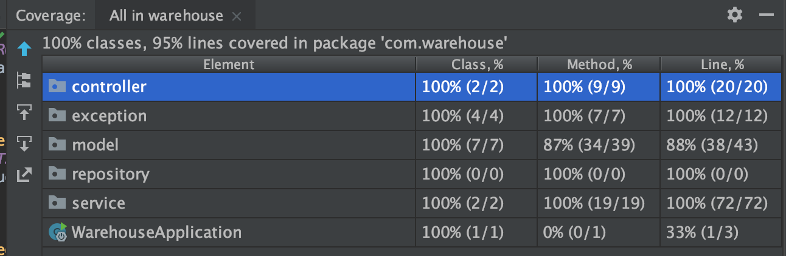

## What is this?

This is a warehouse web application where articles and products can be added via uploading files and products can be sold.

It is a Java 11 application where Spring Boot and Maven are integrated. 
In-memory h2 database is used for persistence.

## How does it work?

### Articles
This is a warehouse application where new articles can be added to the inventory. 
You need to upload the articles files to the database so that they can be used to sell products.

If you add articles which are not in database yet, then they will be created, otherwise the stock of that article will be increased.

Added articles can also be listed.

### Products
Products are sellable items. It contains parts which are needed to construct a product. 
These parts are represented as Articles. In products, we also have the information of how many of which articles are needed to construct.

Added products can be listed. Additionally, only available products can be listed where available count can also be seen.

A product can be sold if it is available (in stock) only. For a sell operation, we check whether we have all the necessary parts of the product or not.
If we do, then we make the sell operation and decrease the stock for articles which are used to construct that product.
 

## How to run?

#### Option 1 (Best option):
Run the application with docker (requires docker installation), it will run in a container, you will not need to install Java and Maven to your local machine.

Just run:
 
    docker-compose up

#### Option 2:
Install Java 11 and Maven and then run application as Spring Boot application from an EDI (IntelliJ etc.)

#### Option 3:
Install Java11 and Maven and then:

- Build (This will generate the _**jar**_ file):

    `mvn clean install`

- Run (Run from an EDI as SpringBoot application or run the following command):
 
    `java -jar target/warehouse-0.0.1.jar`

## How to test?
This application contains both unit tests and integrations tests. You can find them under **src/test**.

Maven build operation already run the `mvn clean install`, you can run this command which will run all tests.

To run the tests only:

    mvn test

Test coverage:

## Endpoints
You can access to the existing endpoint using Swagger: 

`localhost:8080/swagger-ui.html`

The application in default is exposed on port 8080.

### Articles
Get Articles: `localhost:8080/v1/articles` (**GET**)

Add Articles: `localhost:8080/v1/articles` (**PUT**, _requires multipart file as input with name "articlesFile"_)

### Products
Get products: `localhost:8080/v1/products` (**GET**)

Get available products: `localhost:8080/v1/products?isAvailable=true` (**GET**)

Save products: `localhost:8080/v1/products` (**POST**, _requires multipart file as input with name "productsFile"_)

Sell a product: `localhost:8080/v1/products/{id}` (**PATCH**, _id_: generated id of the product)
